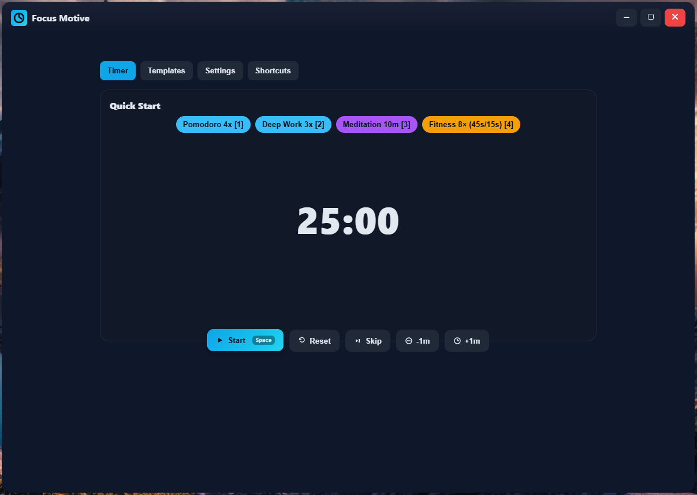

# Cadence Monorepo

Cadence is a lightweight, offline‑first focus & motivation timer for self‑learners and healthy routines.

- Web: Progressive Web App (PWA) built with Svelte + Vite.
- Desktop: Tiny Tauri v2 wrapper for Windows/macOS (optional).
- Monorepo: npm workspaces for shared domain logic and UI tokens.



## Structure

```
cadence/
├─ apps/
│  ├─ web/          # Vite + TypeScript PWA
│  └─ desktop/      # Tauri wrapper (v2)
├─ packages/
│  ├─ core-domain/  # Domain types, engines (timer, schedule)
│  ├─ storage/      # Repo interfaces + adapters (idb, tauri/sqlite)
│  ├─ templates/    # Built-in templates & DSL
│  ├─ notifications/# Web + Tauri notification adapters
│  └─ ui/           # UI tokens and helpers
└─ tooling/
   └─ configs/      # Shared tsconfig, lint configs
```

## Requirements

- Node.js 18+ (20 recommended)
- Git (for cloning and releases)

## Commands (workspace‑aware)

- Web (dev): `npm --workspace apps/web run dev`
- Web (build): `npm --workspace apps/web run build`
- Web (preview): `npm --workspace apps/web run preview`
- Typecheck: `npm --workspace apps/web run typecheck`
- Desktop (build): `npm --workspace apps/desktop run build`

## Development

1) Install dependencies at the monorepo root:

```bash
npm install
```

2) Start the web app (PWA):

```bash
npm --workspace apps/web run dev
```

- The dev server binds to `0.0.0.0` so you can test on other devices via your LAN IP.
- In dev, the PWA service worker is emulated; full offline behavior is guaranteed in a production build.

3) Preview a production build locally:

```bash
npm --workspace apps/web run build
npm --workspace apps/web run preview
```

- Use this preview to validate offline: open the preview URL, switch DevTools → Network → Offline, then reload.
- You should see the app shell and content load from cache; `offline.html` is the final fallback.

4) (Optional) Build desktop installers after the web app is built:

```bash
npm --workspace apps/desktop run build
```

The desktop build copies the web `dist/` into the desktop app and produces installers under:

- `apps/desktop/src-tauri/target/release/bundle/`

## Using Cadence (PWA)

- Install directly from your browser (no app store):
  - Desktop (Chrome/Edge): Click the address‑bar Install icon.
  - Android (Chrome): Menu → Install app.
  - iOS (Safari): Share → Add to Home Screen.
- Share easily:
  - Open the **Get App** page (tab in the header) → use Share / Copy URL / QR to install on other devices.
  - The QR opens `/?install=1`, which routes directly to the Get App page and shows install guidance.
- Works offline:
  - The app shells and assets are cached; an offline page appears if the network is down.
- Updates:
  - A background service worker fetches new versions; you’ll see an “Update available” toast to reload.

## Environment Variables

- `VITE_PUBLIC_BASE_URL`
  - Recommended for production to ensure QR/share always point to the canonical domain, e.g. `https://your-domain/`.
  - For dev LAN testing, you can create `apps/web/.env.local` with `VITE_PUBLIC_BASE_URL=http://<LAN_IP>:5174/`.


## Releasing

- Web (PWA): push to `main` and Vercel deploys automatically.
- Desktop (manual release):
  1. `npm --workspace apps/web run build`
  2. `npm --workspace apps/desktop run build`
  3. Create a GitHub Release and attach the generated `.msi/.exe` (Windows) and `.dmg/.pkg` (macOS) bundles.
- Detailed steps and tips are in [`RELEASE.md`](./RELEASE.md).

## Versioning & Changelog

- We use Changesets for versioning and changelog automation.
- To start a version bump:

```bash
npm run changeset
```

Push to `main` and merge the Version PR that CI opens.

## Code Style

- TypeScript with strict types, no `any`.
- One export per file.
- Avoid magic numbers; use constants.
- JSDoc on public classes and methods.

## Project Highlights

- PWA‑first: instant updates, installable, works offline.
- Keyboard‑driven: global shortcuts, guarded to avoid conflicts while typing.
- Templates and Quick Start chips: predictable block planning with per‑block transitions.
- Desktop (optional): tiny Tauri wrapper with window effects and persistence.
